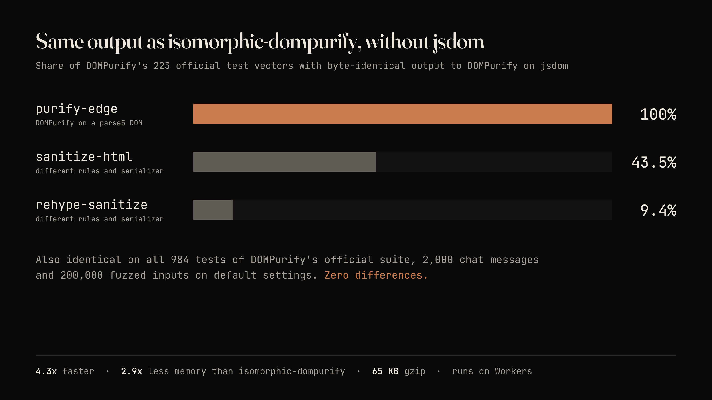
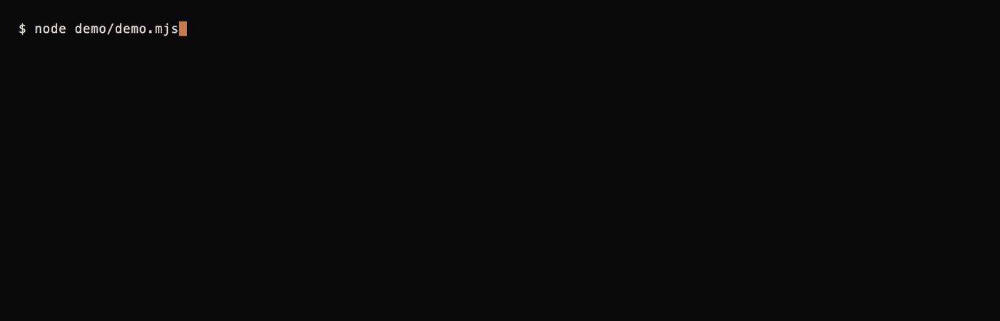

# purify-edge

DOMPurify without jsdom. Byte-identical output, small, runs on Workers and other edge runtimes.





purify-edge runs the unmodified [DOMPurify](https://github.com/cure53/DOMPurify) on a small DOM built on [parse5](https://github.com/inikulin/parse5) instead of jsdom. The sanitizer is DOMPurify. What this package adds is the window DOMPurify runs on: about 800 lines of commented JavaScript in `src/`.

It is verified against DOMPurify **3.4.16**, and only that version (see [Verified against DOMPurify 3.4.16](#verified-against-dompurify-3416)).

## Install

```sh
npm install purify-edge
```

Node 20 or later, or an edge runtime. The runtime code imports nothing from `node:` and uses no Node APIs. It is tested on Node 20, 22 and 24, in the `@edge-runtime/vm` isolate (the one Vercel's edge runtime is built on) and in workerd (Cloudflare Workers, through Miniflare, without the Node compatibility flag). Other runtimes such as Deno and Bun should work but are not tested.

```js
import DOMPurify from "purify-edge";

DOMPurify.sanitize('hello');
// 'hello'
```

The default export is a DOMPurify instance with the same API as DOMPurify in a browser: `sanitize`, `addHook`, `removeHook`, `setConfig`, `clearConfig`, `isValidAttribute`, `removed`, `isSupported`, `version`. Two extra named exports:

```js
import DOMPurify, { createDOMPurify, window } from "purify-edge";

const own = createDOMPurify();   // a fresh instance with its own config and hooks
window;                          // the shim window, for advanced use
```

CommonJS works too: `const DOMPurify = require("purify-edge")` returns the instance (with `.default`, `.createDOMPurify` and `.window` attached). The CJS build bundles parse5, which is ESM-only.

Types are DOMPurify's own, re-exported: `import type { Config } from "dompurify"` works, and so does `import type { Config } from "purify-edge"`.

Copy-paste recipes for Workers, Hono, markdown rendering for AI chat, Next.js, Astro, SvelteKit and migrating from isomorphic-dompurify are in [docs/recipes.md](docs/recipes.md).

## Migrating from isomorphic-dompurify

```diff
-import DOMPurify from "isomorphic-dompurify";
+import DOMPurify from "purify-edge";
```

If you build your own instance with jsdom today, replace this:

```js
import createDOMPurify from "dompurify";
import { JSDOM } from "jsdom";
const DOMPurify = createDOMPurify(new JSDOM("").window);
```

with the same one-line import. Options and hooks carry over unchanged because it is the same DOMPurify.

purify-edge always uses its own window, including in a browser. In the browser use `dompurify` itself, which has a real DOM. Hooks that read DOM properties beyond the few the shim reflects (see below) will see `undefined`.

## Why

jsdom is a very large piece of software to carry along just to give a sanitizer a parser and a tree.

- It is heavy. In the measurements below, DOMPurify on jsdom peaks at 605 MB resident on 2,000 chat-sized documents and 1,236 MB on 50 newsletters, against 209 MB and 307 MB for purify-edge.
- It leaks. In the fuzzing runs, jsdom grew about 30 KB per `sanitize()` call for the life of the process. The shim stayed flat.
- It cannot run on edge runtimes. jsdom needs Node APIs that Workers-style isolates do not have, and DOMPurify needs a DOM to run at all. DOMPurify's maintainers recommend jsdom on the server and, asked about a lighter option, said they know of none where their tests pass: "If you find one where our tests are green, we'd love to know about it" ([cure53/DOMPurify#1583](https://github.com/cure53/DOMPurify/issues/1583#issuecomment-5306897664)).

The obvious alternatives either change the output or change the security. Swapping jsdom for linkedom or happy-dom does not work with DOMPurify unpatched, and the maintainers do not consider happy-dom safe. Other sanitizers (sanitize-html, rehype-sanitize) have their own rules and their own serialization, so their output differs from DOMPurify's.

## Parity

Output compared byte for byte with DOMPurify on jsdom, default config, on DOMPurify's own `expect.mjs` fixture (223 vectors, tag 3.4.16). The other contenders ran the same vectors, and the same 2,000 chat outputs were re-parsed with parse5 (a spec-compliant parser, the way a browser would parse the output string) to count event handlers that would be live.

| Contender | Identical to DOMPurify on jsdom | Live `on*` handlers after re-parse (of 2,000 chat outputs) | Raw string matches |
|---|---|---|---|
| purify-edge | 100% (223 of 223) | 0 | 0 |
| sanitize-html (DOMPurify's default tag and attribute lists) | 43.5% (97 of 223) | 0 | 24 |
| rehype-sanitize (default schema) | 9.4% (21 of 223) | 0 | 44 |

"Raw string matches" is a regex for `on*=` in tag position on the output string, with no re-parse. It over-counts: the matches for sanitize-html and rehype-sanitize are payloads that survived as inert attribute text, which is why the re-parse count is the one that matters.

Read this table with care. For sanitize-html and rehype-sanitize, different bytes mostly mean different serialization and different rules (`` against ``, `&#x3C;` against `&lt;`), not unsafe output. They are different sanitizers, and none of them produced a live event handler on this corpus. The column that matters for a drop-in is the first one: how often your output would change if you switched from isomorphic-dompurify. DOMPurify does not start on lighter DOMs such as linkedom without patching, and the small patch we tried did not make it behave like it does on jsdom, so this repo draws no conclusions about them. [bench/README.md](bench/README.md) has the method.

On the same 2,000 chat responses (about a quarter with injected hostile payloads) and on 50 large newsletter documents (100 KB to 1 MB), purify-edge differed from jsdom 0 times in the earlier verification. `npm run bench:parity` reproduces the 2,000-response result: 0 differing outputs.

## Speed and memory

Reproduce with `npm run bench:speed`; the method, corpus generator and raw per-run numbers are in [bench/README.md](bench/README.md). Apple M5 Max, macOS arm64, Node 24.20.0, run under `nice -n 19`. DOMPurify 3.4.16, isomorphic-dompurify 4.4.0 (jsdom 30.1.2), parse5 8.0.1. Default DOMPurify config everywhere.

- Corpus a: 2,000 marked-rendered chat responses, 2.1 KB on average.
- Corpus c: 50 generated newsletter documents, 100 KB to 1 MB each, 19.7 MB in total.

Throughput is operations per second, the median of 5 runs, each run in its own process. Memory is the peak resident set size of that process.

| Contender | a ops/s | a vs jsdom | c ops/s | c vs jsdom | peak RSS a | peak RSS c | idle RSS |
|---|---|---|---|---|---|---|---|
| DOMPurify on jsdom | 1,757 | 1.0x | 12.1 | 1.0x | 605 MB | 1,236 MB | 162 MB |
| sanitize-html | 9,097 | 5.2x | 71.2 | 5.9x | 328 MB | 413 MB | 63 MB |
| rehype-sanitize | 7,932 | 4.5x | 54.7 | 4.5x | 234 MB | 386 MB | 63 MB |
| **purify-edge** | 7,543 | 4.3x | 57.4 | 4.7x | 209 MB | 307 MB | 62 MB |

So purify-edge is 4.3x to 4.7x faster than DOMPurify on jsdom, with 2.9x to 4.0x lower peak memory. That is a little under the 5x I was aiming for. It is in the same range as sanitize-html and rehype-sanitize, which means parse5 and DOMPurify's own walk set the ceiling, not the shim. This was not profiled further. sanitize-html and rehype-sanitize are not substitutes for DOMPurify; they are in the table as a speed floor.

An earlier measurement, taken with the verification prototype before the packaging cleanup, gave 8,822 ops/s on a and 55.8 on c. The packaged code measures about 15% slower on a (corpus c is unchanged within noise); the table above is the packaged `src/`.

Bundle size, with parse5, DOMPurify and the shim, minified for a neutral platform: 218.5 KB, 65.6 KB gzipped (`npm test` prints the current numbers).

## Security model

**The sanitizer is DOMPurify, unchanged.** purify-edge imports the published `dompurify` package at an exact version and never patches it. Every allow list, hook, config option and mXSS defence is DOMPurify's.

**The shim is the added attack surface.** DOMPurify's maintainers treat the server-side DOM as part of the trusted computing base, and that is true here. `src/dom.js` (the tree) and `src/xml.js` (an XML parser and serializer, used only for `PARSER_MEDIA_TYPE: "application/xhtml+xml"` and non-HTML `NAMESPACE`) are kept small and commented. HTML parsing and serialization are parse5's. The shim implements what DOMPurify 3.4.x calls, and nothing else. Its correctness is argued by comparison with DOMPurify on jsdom, not by reading the code once: the official suite, a differential fuzzer and parity corpora, all described below, run in CI.

**No script execution.** There is no JavaScript engine in the shim. Nothing in sanitized or parsed input is ever run, and scripts, event handlers and `iframe` documents are inert data. `iframe.contentDocument` is a second, separate shim realm.

**Known differences from DOMPurify on jsdom.** All of them are fail-closed (purify-edge keeps less than jsdom, never more) or spec-correct:

- XHTML mode, prefixed `template` elements. In XML, the children of an XHTML-namespace `template` go into its template contents even when the tag is prefixed (`<m:template xmlns:m="http://www.w3.org/1999/xhtml">`). Browsers do this. jsdom appends them as ordinary children, so DOMPurify keeps the content of the removed element. purify-edge, like a browser, does not. Checked against Chrome.
- A literal `]]>` in XML text outside a CDATA section is an error under XML 1.0 section 2.4, so browsers throw and DOMPurify returns an empty string. purify-edge does the same. jsdom's XML parser accepts it and keeps the text.
- An unpaired surrogate in XML mode. jsdom's parser lets a high surrogate swallow the next character, so jsdom reports a parse error. The shim parses, and then the serializer throws. Both end with an empty or error result.
- `<body is="">` (an empty `is` value) is not remembered for `RETURN_DOM` serialization. jsdom does the same. Chrome would serialize it; it is inert, and leaving it out is the fail-closed side. A non-empty `is` value is remembered and serialized, as in browsers.
- Two jsdom bugs where the shim follows the HTML spec and parse5. jsdom 29 puts foster-parented text after the table (`<table>x</table>` gives `<table></table>x`, spec and parse5 give `x<table></table>`), and overwrites attributes on a second `<body>` instead of keeping the first (`<body a=1><body a=9>`). On stock jsdom these inputs differ from purify-edge; the fuzzer patches jsdom's source in memory to remove them from the comparison (`--stock-jsdom` shows the raw count: 2,836 differences in one 800,000-comparison run, all from these two).
- Selectors are tag names, `#id`, `[attr]` and comma lists. Anything else throws. DOMPurify and its suite use nothing more.
- Only a few string IDL properties are reflected from attributes (`href`, `target`, `rel` and a handful more on `a`, `area`, `base`, `link` and `form`), which is what makes the README's `'target' in node` hook work. A hook that reads other IDL properties gets `undefined`.

**Form named-property clobbering is not emulated.** DOMPurify's `SANITIZE_DOM` guards against `<form><input name=x>` shadowing `document` and `form` properties. jsdom does not implement that browser behaviour either, so that branch of DOMPurify is only exercised in real browsers. purify-edge answers DOMPurify's `value in document || value in formElement` check with property-name lists generated from jsdom (`scripts/gen-names.mjs`).

## Verified against DOMPurify 3.4.16

The parity guarantee is per DOMPurify version. For 3.4.16, with the verification and the packaged tests:

- DOMPurify's own official test suite, unmodified, run on the shim window: 984 tests, 1,247 assertions, identical to the jsdom run assertion by assertion, 0 failures. `sh scripts/official-suite.sh` reproduces it; CI runs it.
- A differential fuzzer against DOMPurify on jsdom: more than 250,000 inputs on the four default configs (default, `USE_PROFILES`, `FORBID_TAGS`, `ADD_ATTR` plus the README hook), 0 differences. A further 60,000 inputs on 12 extended configs (`RETURN_DOM`, `RETURN_DOM_FRAGMENT`, `IN_PLACE`, `SAFE_FOR_TEMPLATES`, `WHOLE_DOCUMENT`, `FORCE_BODY`, XHTML, custom elements, profiles, `removed[]`, `NAMESPACE`): 7 differences, all in the two documented XHTML classes above, each one checked to fail closed.
- 2,273 corpus cases (2,000 chat responses, 223 vectors, 50 newsletters), 0 differences.
- The package tests: a few hundred cases compared with DOMPurify on jsdom across several configs, one regression test per bug found during verification, and an edge isolate test.

The official suite does have gaps. Deliberately breaking the shim's shadow root, `textContent`, template-content cloning or `DOMParser` turns it red, but breaking custom-element `disconnectedCallback` handling or attribute case folding does not. The package tests catch case folding (each regression test was checked by reverting its fix). I have not shown that anything catches `disconnectedCallback`, so treat that as unverified.

**Upgrade policy.** The `dompurify` dependency is pinned to an exact version, and so is `parse5`. Moving either pin requires, in the same change: `scripts/official-suite.sh` passing at the new tag, the extended and default fuzz runs showing nothing unexplained, the package tests passing, and this section updated with the new version and numbers. There is no automatic dependency bump for either package.

### Running the checks yourself

```sh
npm ci
npm test                                  # package tests, edge isolate, Workers smoke test
npm run bench:parity                      # parity and live-handler comparison against jsdom, sanitize-html, rehype-sanitize
npm run bench:speed                       # throughput and peak memory, one process per measurement (use nice -n 19)
sh scripts/official-suite.sh              # clones DOMPurify at the pinned tag; needs git, npm and network
node scripts/fuzz.mjs --cases 20000       # the CI smoke run, about 12 seconds
node scripts/fuzz.mjs --cases 200000      # the full default-config run, about 2 minutes
node scripts/fuzz.mjs --ext --cases 60000 # the extended configs, about 4.5 minutes; prints and classifies the known differences
```

The fuzzer runs jsdom in short-lived child processes because of the leak. Use `nice -n 19` for the long runs.

## Layout

- `src/dom.js`: the DOM (tree, selectors, shadow roots, custom elements, template contents, node iterators, DOMParser) and the parse5 tree adapter.
- `src/xml.js`: the XML parser and serializer.
- `src/names.js`: generated property-name lists for the clobber check.
- `src/index.js`: wires DOMPurify to the window.
- `scripts/`: official-suite runner, fuzzer, diff classifier, build.
- `test/`: parity, regression, API, types, edge isolate and Workers tests.
- `bench/`: the comparison benchmark behind the parity and speed tables (not published to npm). `npm run bench:parity`, `npm run bench:speed`.

## Credits

All of the sanitizing is [DOMPurify](https://github.com/cure53/DOMPurify) by Cure53 and contributors. HTML parsing and serialization are [parse5](https://github.com/inikulin/parse5) by Ivan Nikulin and contributors. The tests use DOMPurify's published test vectors, and the shim's behaviour was checked against jsdom throughout. None of these projects endorses or maintains purify-edge, and bugs here should not be reported to them.

## License

MIT. See [LICENSE](LICENSE). DOMPurify is a dependency under its own Apache-2.0 or MPL-2.0 licence and is not redistributed here.
